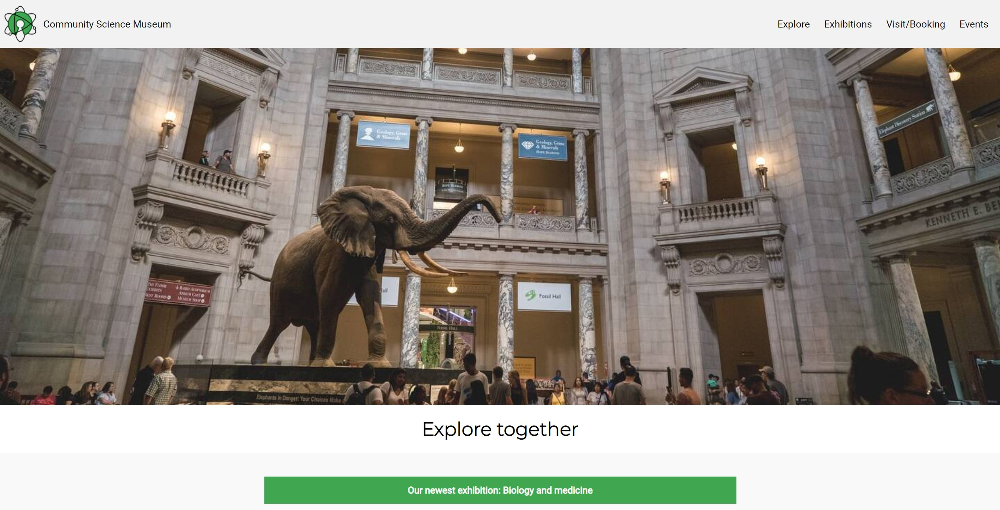
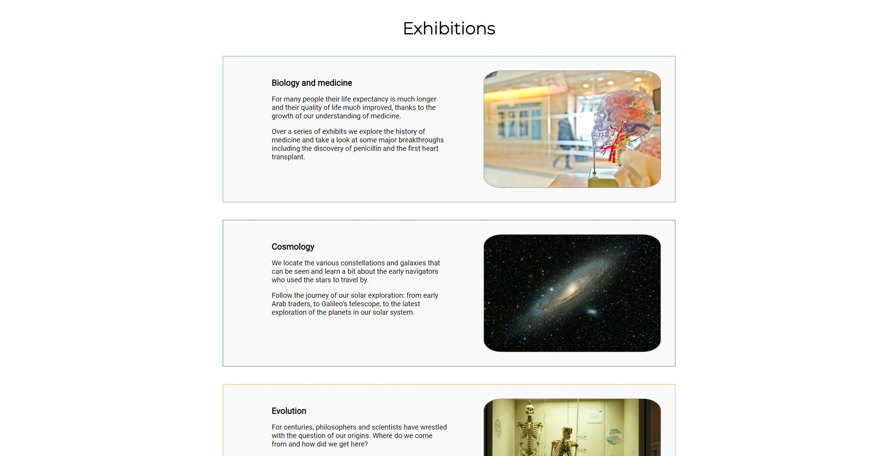
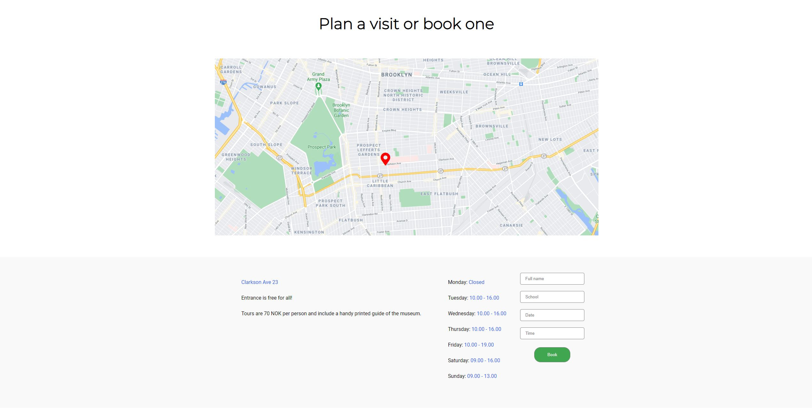

# Community Science Museum

> A website for a fictional museum. Created as my semester project.
> Live demo [_here_](https://escommunitysciencemuseum.netlify.app/). <!-- If you have the project hosted somewhere, include the link here. -->

## Table of Contents

- [General Info](#general-information)
- [Technologies Used](#technologies-used)
- [Features](#features)
- [Screenshots](#screenshots)
- [Setup](#setup)
- [Usage](#usage)
- [Project Status](#project-status)
- [Room for Improvement](#room-for-improvement)
- [Acknowledgements](#acknowledgements)
- [Contact](#contact)
<!-- * [License](#license) -->

## General Information

- This website was for educational purposes only. I was to create a website for a museum that was targeting all ages.
<!-- You don't have to answer all the questions - just the ones relevant to your project. -->

## Technologies Used

- HTML
- CSS

## Screenshots

<!-- If you have screenshots you'd like to share, include them here. -->

## Setup

No setup required

## Project Status

Project is: / _complete_ /

## Contact

Created by [@EivindSimonsen](https://www.linkedin.com/in/eivind-simonsen-9469121b9/) - feel free to contact me!
